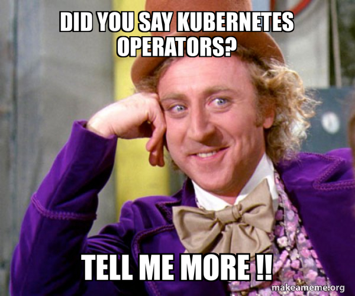

<!-- page_number: true -->
<!-- $size: A4 -->

<div style="text-align:center"></div>

<!--s-->

## whoami
 <div class="row" style="display:flex">
  <div class="column" style="flex:50%">
    
  </div>
  <div class="column" style="flex:50%;text-align:left">
    <li> Cloud Native Consultant</li>
    </br>
    <li> You can find me as <b>mendrugory</b> on internet </li>
    </br>
    <li> Visit <b>www.adysof.com</b> to see professional stuffs </li>
  </div>
</div> 

<!--s-->

# Introduction to Kubernetes Operators


<!--s-->

## Manual Maintenance

<div style="display:block;margin-left:auto;margin-right:auto;width:60%;"></div>

<!--s-->


<div style="display:block;margin-left:auto;margin-right:auto;width:60%;"></div>

<!--s-->

## Automation

<div style="display:block;margin-left:auto;margin-right:auto;width:80%;"></div>

<!--s-->

<div style="display:block;margin-left:auto;margin-right:auto;width:100%;"></div>

<!--s-->

<embed type="text/html" src="https://kubernetes.io/" width="1000" height="600"> 


<!--s-->

## Kubernetes Architecture

<div style="display:block;margin-left:auto;margin-right:auto;width:100%;"></div>


<!--s-->

## Local Kubernetes

<!--s-->

<embed type="text/html" src="https://minikube.sigs.k8s.io/docs/start/" width="1000" height="600"> 

<!--s-->

<embed type="text/html" src="https://kind.sigs.k8s.io/" width="1000" height="600"> 


<!--s-->

## Dev Container

<div style="display:block;margin-left:auto;margin-right:auto;width:90%;"></div>

<p>https://github.com/adysof/devcontainer-operators-development</p>

<!--s-->


## Kubernetes Operators

<!--s-->

### Do you know your infra/app?

<!--s-->

## Life Cycle

<div style="display:block;margin-left:auto;margin-right:auto;width:60%;"></div>

*Pod's life cycle example*


<!--s-->

## Reconcilation Approaches

<div style="display:block;margin-left:auto;margin-right:auto;width:60%;"></div>

<div style="text-align:right;font-size:18px;">Image from Programming Kubernetes, O'Reilly Media</div>

<!--s-->


### How is my infra/app represented?

<!--s-->


## CRD

```yaml
apiVersion: operator.adysof.com/v1alpha1
kind: MyCRD
metadata:
	name: mycrd
	namespace: test
spec:
	replicas: 3
```

<!--s-->

### Am I alone?

<!--s-->

<embed type="text/html" src="https://operatorhub.io/" width="1000" height="600"> 

<!--s-->


# Kubernetes API


<!--s-->

# API Server

<div style="display:block;margin-left:auto;margin-right:auto;width:50%;"></div>

<!--s-->

<embed type="text/html" src="https://kubernetes.io/docs/concepts/overview/kubernetes-api/" width="1000" height="600"> 


<!--s-->

## Let's check it out


<!--s-->

## Checking API

```bash
$ kubectl get ns -v=6
I0209 16:26:13.738059  569624 loader.go:372] Config loaded from file:  /home/user/.kube/config
I0209 16:26:13.748526  569624 round_trippers.go:454] GET https://127.0.0.1:44365/api/v1/namespaces?limit=500 200 OK in 6 milliseconds
NAME                 STATUS   AGE
default              Active   76m
ingress-nginx        Active   76m
kube-node-lease      Active   76m
kube-public          Active   76m
kube-system          Active   76m
local-path-storage   Active   76m
```

<!--s-->

## Exposing API

```bash
$ kubectl proxy --port=5555
Starting to serve on 127.0.0.1:5555
```

<!--s-->

## Kubernetes API

```bash
$ curl http://127.0.0.1:5555/api/v1/namespaces
```

<!--s-->

## Checking API

```bash
$ kubectl create ns test-kubectl -v=10
```

<!--s-->

## Kubernetes API

```bash
$ curl --version
curl 7.68.0 (x86_64-pc-linux-gnu) libcurl/7.68.0 OpenSSL/1.1.1f zlib/1.2.11 brotli/1.0.7 libidn2/2.2.0 libpsl/0.21.0 (+libidn2/2.2.0) libssh/0.9.3/openssl/zlib nghttp2/1.40.0 librtmp/2.3
 
$ curl -XPOST \
  -H "Accept: application/json, */*" \
  -H "Content-Type: application/json" \
  -H "User-Agent: curl 7.68.0" \
  'http://127.0.0.1:5555/api/v1/namespaces?fieldManager=curl-create' \
  -d '{"kind":"Namespace","apiVersion":"v1","metadata":{"name":"test-curl"},"spec":{}}'
```

<!--s-->

## Kubernetes API Resources

```bash
$ kubectl api-resources
```

<!--s-->


## Kubernetes API Resources

```bash
$ curl http://127.0.0.1:5555/api/v1/nodes
```

```bash
$ curl http://127.0.0.1:5555/api/v1/nodes/operators-control-plane
```
<!--s-->

## Kubernetes API Resources

```bash
$ curl http://127.0.0.1:5555/api/v1/namespaces/default/services
```

```bash
$ curl http://127.0.0.1:5555/api/v1/namespaces/default/services/kubernetes
```
<!--s-->

# API Access Control

<!--s-->

## Authentication

<!--s-->

<embed type="text/html" src="https://kubernetes.io/docs/reference/access-authn-authz/authentication/" width="1000" height="600"> 


<!--s-->

## Authorization

<!--s-->

<embed type="text/html" src="https://kubernetes.io/docs/reference/access-authn-authz/rbac/" width="1000" height="600"> 


<!--s-->

## you are admin, right?

<!--s-->

## Can I list Pods?

```bash
$ kubectl auth can-i list pods
yes
```

<!--s-->

## Can I create Deployments?

```bash
$ kubectl auth can-i create deployments
yes
```

<!--s-->

## Can I delete Services?

```bash
$ kubectl auth can-i delete svc
yes
```

<!--s-->

## How to create a Service Account

```bash
$ kubectl create sa my-sa --dry-run=client -o yaml
apiVersion: v1
kind: ServiceAccount
metadata:
  creationTimestamp: null
  name: my-sa
```

<!--s-->


## How to create a Service Account

```bash
$ kubectl create sa my-sa 
```

<!--s-->

## Can SA list Pods?

```bash
$ kubectl auth can-i list pods \
  --as system:serviceaccount:default:my-sa
no
```

<!--s-->

## Can SA create Deployments?

```bash
$ kubectl auth can-i create deployments \
  --as system:serviceaccount:default:my-sa
no
```

<!--s-->


## Can SA delete Services?

```bash
$ kubectl auth can-i delete svc \
  --as system:serviceaccount:default:my-sa
no
```

<!--s-->

## Create a Role

```bash
$ kubectl create role my-sa --resource=pods --verb=list,get --dry-run=client -o yaml
apiVersion: rbac.authorization.k8s.io/v1
kind: Role
metadata:
  creationTimestamp: null
  name: my-sa
rules:
- apiGroups:
  - ""
  resources:
  - pods
  verbs:
  - list
  - get
```


<!--s-->

## Create a Role

```bash
$ kubectl create role my-sa --resource=pods --verb=list,get
role.rbac.authorization.k8s.io/my-sa created
```

<!--s-->

## Create a RoleBinding

```bash
$ kubectl create rolebinding my-sa --role=my-sa --serviceaccount=default:my-sa --dry-run=client -o yaml
apiVersion: rbac.authorization.k8s.io/v1
kind: RoleBinding
metadata:
  creationTimestamp: null
  name: my-sa
roleRef:
  apiGroup: rbac.authorization.k8s.io
  kind: Role
  name: my-sa
subjects:
- kind: ServiceAccount
  name: my-sa
  namespace: default
```

<!--s-->

## Create a RoleBinding

```bash
$ kubectl create rolebinding my-sa --role=my-sa --serviceaccount=default:my-sa
rolebinding.rbac.authorization.k8s.io/my-sa created
```

<!--s-->

## Can SA get pods?

```bash
$ kubectl auth can-i get pods \
  --as system:serviceaccount:default:my-sa
yes
```

<!--s-->

## Can SA delete pods?

```bash
$ kubectl auth can-i delete pods \
  --as system:serviceaccount:default:my-sa
no
```

<!--s-->

## Check SA secret

```bash
$ kubectl get sa my-sa -o yaml
apiVersion: v1
kind: ServiceAccount
metadata:
  creationTimestamp: "2022-02-11T15:28:43Z"
  name: my-sa
  namespace: default
  resourceVersion: "570"
  uid: 7af3e7c1-2f8b-4256-b5db-43b0699b931a
secrets:
- name: my-sa-token-jzntp
```

<!--s-->

## Check SA secret

```bash
$ kubectl get secret my-sa-token-jzntp -o yaml
```

<!--s-->

## Export Token

```bash
$ TOKEN=$(kubectl get secret my-sa-token-jzntp -o json \
  | jq -r ".data.token" \
  | base64 -d)
```

<!--s-->

## REST API SA

<embed type="text/html" src="https://kubernetes.io/docs/reference/access-authn-authz/authentication/#putting-a-bearer-token-in-a-request" width="1000" height="600"> 

<!--s-->

## REST API SA

```bash
$ curl -k \
  -H "Authorization: Bearer $TOKEN" \
  https://127.0.0.1:33257/api/v1/namespaces/default/pods

$ curl -k \
  -H "Authorization: Bearer $TOKEN" \
  https://127.0.0.1:33257/apis/apps/v1/namespaces/default/deployments
```

<!--s-->

## Operator Framework SDK


<!--s-->

<embed type="text/html" src="https://sdk.operatorframework.io/" width="1000" height="600"> 

<!--s-->

## Download from Github

```bash
## Linux by default
$ export ARCH=$(case $(uname -m) in x86_64) echo -n amd64 ;; aarch64) echo -n arm64 ;; *) echo -n $(uname -m) ;; esac)
$ export OS=$(uname | awk '{print tolower($0)}')
$ export VERSION=v1.17.0
$ export OPERATOR_SDK_DL_URL=https://github.com/operator-framework/operator-sdk/releases/download/${VERSION}
$ curl -LO ${OPERATOR_SDK_DL_URL}/operator-sdk_${OS}_${ARCH}
$ chmod +x operator-sdk_${OS}_${ARCH}
$ sudo mv operator-sdk_${OS}_${ARCH} /usr/local/bin/operator-sdk
```

<!--s-->
## Operator SDK

```bash
$ operator-sdk --help
```

<!--s-->

# Grav as a Service

<!--s-->

### Grav

<div style="display:block;margin-left:auto;margin-right:auto;width:100%;"></div>


<!--s-->


## How to architect a virtual Grav infrastructure in Kubernetes?

<!--s-->

## Kubernetes Architecture

<div style="display:block;margin-left:auto;margin-right:auto;width:100%;"></div>


<!--s-->

## Let's code

<div style="display:block;margin-left:auto;margin-right:auto;width:100%;"></div>

<!--s-->

## Operator SDK


```bash
$ operator-sdk init \
  --domain=adysof.com \
  --repo=github.com/adysof/course-operator
Writing kustomize manifests for you to edit...
Writing scaffold for you to edit...
Get controller runtime:
$ go get sigs.k8s.io/controller-runtime@v0.11.0
go: downloading golang.org/x/net v0.0.0-20210825183410-e898025ed96a
go: downloading golang.org/x/oauth2 v0.0.0-20210819190943-2bc19b11175f
go: downloading golang.org/x/sys v0.0.0-20211029165221-6e7872819dc8
Update dependencies:
$ go mod tidy
go: downloading cloud.google.com/go v0.81.0
go: downloading golang.org/x/crypto v0.0.0-20210817164053-32db794688a5
Next: define a resource with:
$ operator-sdk create api
```

</div>

<!--s-->

## Operator SDK

```bash
$ operator-sdk create api \
  --group operator \
  --version v1alpha1 \
  --kind Grav \
  --resource=true \
  --controller=true
```

<!--s-->

## Operator SDK

```bash
$ make generate
```

<!--s-->

## Operator SDK

```bash
$ make manifests
```

<!--s-->

### API

```go
package v1alpha1

import (
	appsv1 "k8s.io/api/apps/v1"
	corev1 "k8s.io/api/core/v1"
	networkingv1 "k8s.io/api/networking/v1"
	metav1 "k8s.io/apimachinery/pkg/apis/meta/v1"
)

// GravSpec defines the desired state of Grav
type GravSpec struct {
	Domain string `json:"domain"`
}

// GravStatus defines the observed state of Grav
type GravStatus struct {
	Deployment DeploymentStatus `json:"deployment,omitempty"`
	Service    ServiceStatus    `json:"service,omitempty"`
	Ingress    IngressStatus    `json:"ingress,omitempty"`
}

type DeploymentStatus struct {
	Name                    string `json:"name"`
	appsv1.DeploymentStatus `json:",inline"`
}

type ServiceStatus struct {
	Name                 string `json:"name"`
	corev1.ServiceStatus `json:",inline"`
}

type IngressStatus struct {
	Name                       string `json:"name"`
	networkingv1.IngressStatus `json:",inline"`
}

//+kubebuilder:object:root=true
//+kubebuilder:subresource:status

// Grav is the Schema for the gravs API
type Grav struct {
	metav1.TypeMeta   `json:",inline"`
	metav1.ObjectMeta `json:"metadata,omitempty"`

	Spec   GravSpec   `json:"spec,omitempty"`
	Status GravStatus `json:"status,omitempty"`
}

//+kubebuilder:object:root=true

// GravList contains a list of Grav
type GravList struct {
	metav1.TypeMeta `json:",inline"`
	metav1.ListMeta `json:"metadata,omitempty"`
	Items           []Grav `json:"items"`
}

func init() {
	SchemeBuilder.Register(&Grav{}, &GravList{})
}

```

<!--s-->

## Install

```bash
$ make generate && make manifests && make install
```

<!--s-->

## Check new CRD

```bash
$ kubectl api-resources | grep grav
gravs	operator.adysof.com/v1alpha1	true	Grav
```


<!--s-->

## Resource

*./config/samples/operator_v1alpha1_grav.yaml*
```yaml
apiVersion: operator.adysof.com/v1alpha1
kind: Grav
metadata:
  name: mygrav
spec:
  domain: www.mygrav.com

```

<!--s-->

## Resource

```bash
$ kubectl apply -f ./config/samples/operator_v1alpha1_grav.yaml
grav.operator.adysof.com/mygrav created
```

<!--s-->

## Resource

```bash
$ kubectl get gravs.operator.adysof.com 
NAME     AGE
mygrav   24s
```


<!--s-->

> That's just an API REST saving data into ETCD

<!--s-->


## RBAC

```go
//+kubebuilder:rbac:groups=operator.adysof.com,resources=gravs,verbs=get;list;watch;create;update;patch;delete
//+kubebuilder:rbac:groups=operator.adysof.com,resources=gravs/status,verbs=get;update;patch
//+kubebuilder:rbac:groups=operator.adysof.com,resources=gravs/finalizers,verbs=update
//+kubebuilder:rbac:groups=apps,resources=deployments,verbs=get;list;watch;create;update;patch;delete
//+kubebuilder:rbac:groups=core,resources=services,verbs=get;list;watch;create;update;patch;delete
//+kubebuilder:rbac:groups=*,resources=ingresses,verbs=get;list;watch;create;update;patch;delete
```

<!--s-->

## RBAC

```bash
$ make manifests
```

> Check *./config/rbac/role.yaml*

<!--s-->
## Operator

```go
func (r *WordpressReconciler) Reconcile(ctx context.Context, req ctrl.Request) (ctrl.Result, error) {
  _ = log.FromContext(ctx)

  grav := &operatorv1alpha1.Grav{}
  if err := r.Client.Get(ctx, req.NamespacedName, grav); err != nil {
    if k8serrors.IsNotFound(err) {
      return ctrl.Result{}, nil
    }
    return ctrl.Result{}, err
  }

  return ctrl.Result{}, nil
}
```


<!--s-->

## Debug Operator

```json
{
    "version": "0.2.0",
    "configurations": [
        {
            "name": "Debug",
            "type": "go",
            "request": "launch",
            "mode": "auto",
            "program": "${workspaceFolder}",
            "args": [
                "--metrics-bind-address=:7085",
                "--health-probe-bind-address=:7086",
            ],
            "env": {
            }
        }
    ]
}

```

<!--s-->

## Watching Resources

```go
// SetupWithManager sets up the controller with the Manager.
func (r *GravReconciler) SetupWithManager(mgr ctrl.Manager) error {
    return ctrl.NewControllerManagedBy(mgr).
		For(&operatorv1alpha1.Grav{}).
		Owns(&appsv1.Deployment{}).
		Owns(&corev1.Service{}).
		Owns(&networkingv1.Ingress{}).
		Complete(r)
}
```

<!--s-->

## Deployment

<!--s-->


### Deployment


```diff
+	deployment := &appsv1.Deployment{
+		ObjectMeta: v1.ObjectMeta{
+			Name:		grav.GetName(),
+			Namespace:	grav.GetNamespace(),
+		},
+	}
```

<!--s-->

### Mutate Deployment

```diff
+func mutateDeployment(ctx context.Context, deployment *appsv1.Deployment, grav *operatorv1alpha1.Grav, scheme *runtime.Scheme) func() error {
+	return func() error {
+		deployment.Spec.Template.ObjectMeta = metav1.ObjectMeta{
+			Labels: map[string]string{
+				"app": grav.GetName(),
+			},
+		}
+		deployment.Spec.Selector = &metav1.LabelSelector{
+			MatchLabels: map[string]string{
+				"app": grav.GetName(),
+			},
+		}
+		deployment.Spec.Template.Spec.Containers = []corev1.Container{
+			{
+				Name:                     "grav",
+				Image:                    "adysof/grav",
+				ImagePullPolicy:          corev1.PullIfNotPresent,
+				TerminationMessagePath:   "/dev/termination-log",
+				TerminationMessagePolicy: "File",
+			},
+		}
+
+		return controllerutil.SetControllerReference(grav, deployment, scheme)
+	}
+}
```

<!--s-->

### Deployment


```diff
+	result, err := controllerutil.CreateOrUpdate(ctx, r.Client, deployment, mutateDeployment(ctx, deployment, grav, r.Scheme))
+}
```

<!--s-->

### Update Status

```diff
+func (r *GravReconciler) updateStatus(ctx context.Context, namespacedName k8stypes.NamespacedName, update func(grav *operatorv1alpha1.Grav)) error {
+	grav := &operatorv1alpha1.Grav{}
+
+	if err := r.Client.Get(ctx, namespacedName, grav); err != nil {
+		return err
+	}
+
+	update(grav)
+
+	if err := r.Status().Update(ctx, grav); err != nil {
+		return fmt.Errorf("error updating grav status: %s", err)
+	}
+
+	return nil
+}
```

<!--s-->

### Deployment

```diff
+	if err != nil {
+		return ctrl.Result{}, err
+	}
+	if result != controllerutil.OperationResultNone {
+		if err := r.updateStatus(ctx, req.NamespacedName, func(grav *operatorv1alpha1.Grav) {
+			grav.Status.Deployment.Name = deployment.GetName()
+			grav.Status.Deployment.DeploymentStatus = deployment.Status
+		}); err != nil {
+			return ctrl.Result{}, err
+		}
+
+		logger.Info(fmt.Sprintf("%s deployment has been configured", deployment.GetName()))
+		return ctrl.Result{}, nil
+	}
+}
```


<!--s-->

### Mutate Service

```diff
+func mutateService(ctx context.Context, service *corev1.Service, grav *operatorv1alpha1.Grav, scheme *runtime.Scheme) func() error {
+	return func() error {
+		service.ObjectMeta.Labels = map[string]string{
+			"app": grav.GetName(),
+		}
+		service.Spec.Selector = map[string]string{
+			"app": grav.GetName(),
+		}
+
+		service.Spec.Ports = []corev1.ServicePort{
+			{
+				Protocol:   corev1.ProtocolTCP,
+				Port:       80,
+				TargetPort: intstr.FromInt(80),
+			},
+		}
+
+		return controllerutil.SetControllerReference(grav, service, scheme)
+	}
+}
```

<!--s-->

## Service

```diff
+	// Service
+	service := &corev1.Service{
+		ObjectMeta: v1.ObjectMeta{
+			Name:      grav.GetName(),
+			Namespace: grav.GetNamespace(),
+		},
+	}
+
+	result, err = controllerutil.CreateOrUpdate(ctx, r.Client, service, mutateService(ctx, service, grav, r.Scheme))
+	if err != nil {
+		return ctrl.Result{}, err
+	}
+	if result != controllerutil.OperationResultNone {
+		if err := r.updateStatus(ctx, req.NamespacedName, func(grav *operatorv1alpha1.Grav) {
+			grav.Status.Service.Name = service.GetName()
+			grav.Status.Service.ServiceStatus = service.Status
+		}); err != nil {
+			return ctrl.Result{}, err
+		}
+
+		logger.Info(fmt.Sprintf("%s service has been configured", service.GetName()))
+		return ctrl.Result{}, nil
+	}
```


<!--s-->

## Mutate Ingress

```diff
+func mutateIngress(ctx context.Context, ingress *networkingv1.Ingress, grav *operatorv1alpha1.Grav, scheme *runtime.Scheme) func() error {
+	return func() error {
+		ingress.ObjectMeta.Labels = map[string]string{
+			"app": grav.GetName(),
+		}
+
+		pathType := networkingv1.PathTypePrefix
+
+		ingress.Spec.Rules = []networkingv1.IngressRule{
+			{
+				Host: grav.Spec.Domain,
+				IngressRuleValue: networkingv1.IngressRuleValue{
+					HTTP: &networkingv1.HTTPIngressRuleValue{
+						Paths: []networkingv1.HTTPIngressPath{
+							{
+								Path:     "/",
+								PathType: &pathType,
+								Backend: networkingv1.IngressBackend{
+									Service: &networkingv1.IngressServiceBackend{
+										Name: grav.Status.Service.Name,
+										Port: networkingv1.ServiceBackendPort{
+											Number: 80,
+										},
+									},
+								},
+							},
+						},
+					},
+				},
+			},
+		}
+
+		return controllerutil.SetControllerReference(grav, ingress, scheme)
+	}
+}
```

<!--s-->

## Ingress

```diff
+	// Ingress
+	ingress := &networkingv1.Ingress{
+		ObjectMeta: v1.ObjectMeta{
+			Name:      grav.GetName(),
+			Namespace: grav.GetNamespace(),
+		},
+	}
+
+	result, err = controllerutil.CreateOrUpdate(ctx, r.Client, ingress, mutateIngress(ctx, ingress, grav, r.Scheme))
+	if err != nil {
+		return ctrl.Result{}, err
+	}
+	if result != controllerutil.OperationResultNone {
+		if err := r.updateStatus(ctx, req.NamespacedName, func(grav *operatorv1alpha1.Grav) {
+			grav.Status.Ingress.Name = ingress.GetName()
+			grav.Status.Ingress.IngressStatus = ingress.Status
+		}); err != nil {
+			return ctrl.Result{}, err
+		}
+
+		logger.Info(fmt.Sprintf("%s ingress has been configured", ingress.GetName()))
+		return ctrl.Result{}, nil
+	}	
```


<!--s-->

## Registering Domain

```bash
$ echo "127.0.0.1	www.mygrav.com" >> /etc/hosts
```


<!--s-->

## Grav

<div style="display:block;margin-left:auto;margin-right:auto;width:100%;"></div>


<!--s-->

## RBAC

```bash 
$ kubectl create role gravadmin \
  --resource=gravs \
  --verb=list,get,create,delete,update,patch

$ kubectl create rolebinding my-sa-gravadmin \
 --role=gravadmin \
 --serviceaccount=default:my-sa
```

<!--s-->

```bash
$ curl -XPOST -H "Authorization: Bearer $TOKEN" \ 
  -H "Content-Type: application/json" -k \
  https://127.0.0.1:46221/apis/operator.adysof.com/v1alpha1/namespaces/default/gravs?fieldManager=curl \
  -d '{"apiVersion":"operator.adysof.com/v1alpha1","kind":"Grav","metadata":{"name":"mygrav","namespace":"default"},"spec":{"domain":"www.mygrav.com"}}'
```

<!--s-->

## Next Steps

* SW Engineering
* Storage
* HA
* ...
* Whatever you can imaging


<!--s-->


## Q&A

<div style="display:block;margin-left:auto;margin-right:auto;width:60%;"></div>
